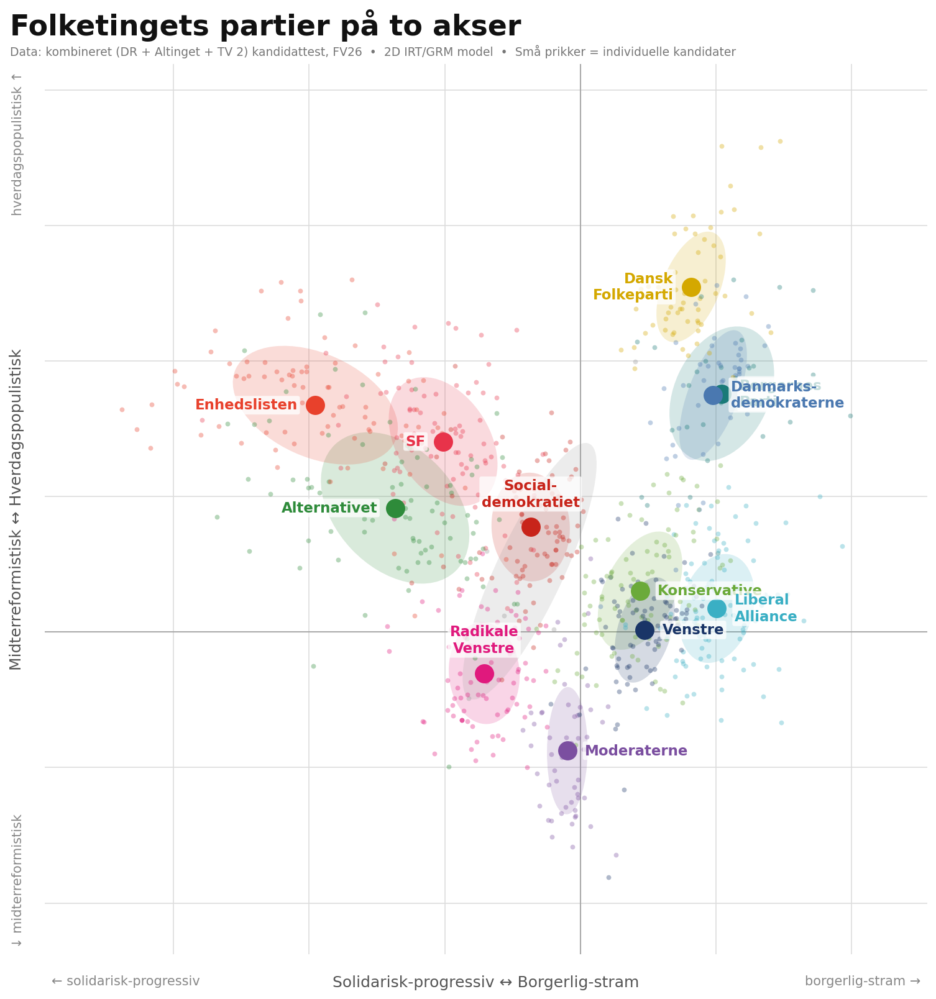

# Valgtest – Politisk Kompas

A data-driven political compass for the Danish 2026 general election (*Folketingsvalget 2026*), built by scraping DR's Kandidattest and fitting a 2-dimensional Item Response Theory model to the answers.



## What is this?

DR and Altinget both run a *Kandidattest* where every candidate for parliament answers political questions on a 1–5 scale (strongly disagree → strongly agree). This project collects all those answers and uses a psychometric model to place every candidate — and their party — in a 2D political space, without any manual labelling of axes.

## Data

Two sources are scraped and combined:

- **DR** (`scrape.py`): 25 questions, 933 candidates across all 92 constituencies
- **Altinget** (`scrape_altinget.py`): 29 questions, 933 candidates

The two tests share 21 questions; together they cover **33 unique questions**. Note that Altinget uses a 4-point scale (1–2–4–5, no neutral option), while DR uses 1–5. Responses are recoded to consecutive integers per item before fitting.

After combining and filtering candidates with fewer than 20 answers: **878 candidates** with an average of 31 questions answered each.

The combined data is in `combined/questions.json`, `combined/candidates.json`, and `abilities.csv`.

## Methodology

### 1. Scraping

**DR** (`scrape.py`): DR's site is a Next.js app that embeds data as JSON inside `__next_f.push(...)` script tags in the HTML. The scraper fetches all 92 constituency pages, extracts candidate `urlKey` identifiers, and retrieves each candidate's `candidateAnswers` array (QuestionID → 1–5 answer).

**Altinget** (`scrape_altinget.py`): Altinget's API is queried directly for candidates and their answers. Altinget uses a 4-point scale (1–2–4–5) with no neutral option.

**Combining** (`combine.py`): Candidates are matched by `urlKey` across sources. For questions answered in both sources, the first source's answer takes precedence. The result is a unified dataset with 33 questions and 878 candidates.

### 2. IRT Model (`analyze.py`)

Rather than doing PCA on raw responses, we fit a **multidimensional Graded Response Model (GRM)** — a psychometric model designed for ordinal data. The GRM:

- Models each answer as an ordinal response drawn from a latent trait distribution
- Estimates item parameters (discrimination and difficulty thresholds per question) and person parameters (ability coordinates per candidate) jointly via **Marginal Maximum Likelihood (MML)**
- Uses a 21×21 Gauss-Hermite quadrature grid for numerical integration over the 2D latent space

We fit **2 latent dimensions**, giving each candidate a coordinate `(θ₁, θ₂)` that captures the two dominant axes of political variation across the 25 questions.

Implementation uses the [`girth`](https://github.com/eribean/girth) library (`multidimensional_grm_mml`).

### 3. Varimax Rotation

The raw GRM solution is rotationally indeterminate (any orthogonal rotation of the factor space fits the data equally well). We apply **varimax rotation** to the discrimination matrix to make the axes as interpretable as possible.

Varimax maximises the variance of squared loadings — it pushes each question toward loading heavily on *one* dimension and near-zero on the other (simple structure). This is the standard psychometric criterion for choosing a rotation without external constraints.

**Why not anchor on party positions (e.g. Enhedslisten ↔ Liberal Alliance as the x-axis)?**

We tested this and quantified the difference:

| Metric | Varimax | Party-anchored |
|---|---|---|
| Simple structure score | **28.1** | 23.0 |
| Mean item complexity (Hofmann) | **1.293** | 1.425 |

Varimax wins on both standard criteria. The party-anchored rotation sacrifices item-level simple structure to make party *positions* more intuitive — a tradeoff, not an improvement. Varimax is the principled choice.

### 4. Axis Orientation

After varimax, we fix the two sign ambiguities using well-known anchor parties (any orthogonal rotation that only flips signs is equally valid):

- **Dim 1 (x)**: flipped so Liberal Alliance is right, Enhedslisten is left
- **Dim 2 (y)**: flipped so Dansk Folkeparti is top, Radikale Venstre is bottom

### 5. Question Loadings

#### Dim 1 — Solidarisk-progressiv ↔ Borgerlig-stram

This is the classical *"old politics"* left–right axis: redistribution, state vs market, and collective vs individual provision. In Danish politics this axis also bundles immigration hardness tightly with economic conservatism — the two clusters are empirically inseparable among candidates.

Top 10 questions by absolute loading on Dim 1 (negative = solidarisk-progressiv, positive = borgerlig-stram):

| Loading | Topic | Question |
|---:|---|---|
| +3.89 | Økonomi | Staten skal skære i støtten til Danmarks Radio |
| +3.81 | Udlændinge | Danmark skal bruge færre penge på udviklingsbistand |
| −3.71 | Skat | Boligejere der tjener på prisstigninger skal betale mere i skat |
| −3.53 | Transport | Vigtigere at investere i tog og busser end i motorveje |
| +3.51 | Udlændinge | Vigtigere at udvise kriminelle udlændinge end at overholde internationale konventioner |
| +3.50 | Udlændinge | Ansøgere om statsborgerskab skal screenes for antidemokratiske holdninger |
| −3.47 | Social | Overførselsindkomsten til de fattigste kontanthjælpsmodtagere skal sættes op |
| −3.45 | Skat | Skatten for de højeste indkomster skal sættes op |
| +3.12 | Social | OK at ulighed stiger, så længe alle bliver rigere |
| +3.04 | Skat | Selskabsskatten skal sænkes |

4 of the top 10 items are immigration or foreign-aid related, loading at the same magnitude as the economic items. They cannot be separated by any orthogonal rotation: harder immigration stances and lower-tax preferences co-vary tightly on a single dimension among Danish candidates. The combined model also adds corporate tax cuts (+3.04) from Altinget, reinforcing the economic right cluster.

#### Dim 2 — Midterreformistisk ↔ Hverdagspopulistisk

This is a *"new politics"* second axis, but not in the conventional GAL–TAN sense. Rather than separating green/libertarian from authoritarian/nationalist positions, it separates a **reform-and-pragmatism** orientation (raise the pension age, accept foreign labour, prefer centrist coalitions, fund Ukraine) from a **protection-and-protest** orientation (restore Store Bededag, shorten working hours, protect fuel prices, oppose pension reform). This maps onto the Danish distinction between a technocratic center bloc and a populist protest wing that spans both sides of Dim 1.

Top 10 questions by absolute loading on Dim 2, with Dim 1 loading for context (negative = midterreformistisk, positive = hverdagspopulistisk):

| Dim 2 | Dim 1 | Topic | Question |
|---:|---:|---|---|
| −2.14 | +1.46 | Økonomi | Folkepensionsalderen skal fortsat stige med levealderen |
| −1.72 | −0.44 | Regeringsdannelse | Det vil være bedst med en regering hen over midten |
| −1.66 | −1.31 | Økonomi | Åbn for mere udenlandsk arbejdskraft fra lande uden for Europa |
| +1.57 | +0.31 | Økonomi | Store Bededag skal genindføres som helligdag |
| −1.42 | +1.46 | Økonomi | Fremtidens ældrepleje skal sikres ved, at folk i job selv er med til at sikre |
| +1.26 | +0.55 | Økonomi | Danmark bruger for mange penge på at støtte Ukraine |
| +1.18 | +2.77 | Transport | Afgifter på benzin og diesel skal sænkes |
| −1.17 | +3.04 | Skat | Selskabsskatten skal sænkes |
| −1.09 | +3.12 | Social | OK at ulighed stiger, så længe alle bliver rigere |
| +0.99 | −2.55 | Økonomi | Politikerne skal arbejde for at sætte arbejdstiden ned |

Questions primarily on Dim 2 (small Dim 1): pension reform (−2.14), cross-party government (−1.72), Store Bededag (+1.57), self-funded eldercare (−1.42), Ukraine (+1.26). These are labour-supply and pragmatism questions, not immigration questions. Cross-loading items (benzin, corporate tax, foreign labour, working hours) reflect within-bloc splits after controlling for Dim 1.

## Reproducing

```bash
pip install requests beautifulsoup4 girth numpy matplotlib scipy

# Scrape DR candidates (~5 min, resumable)
python scrape.py

# Scrape Altinget candidates (~2 min)
python scrape_altinget.py

# Combine both sources into combined/
python combine.py . altinget --out combined

# Fit the IRT model (~1 min)
python analyze.py combined

# Generate political compass
python plot.py combined
```

> **Note:** `girth 0.8.0` uses the deprecated `scipy.stats.mvn.mvnun` API (removed in SciPy 2.0). Two patches are required for newer SciPy — see comments in the source for details.
